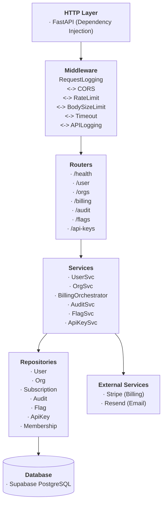
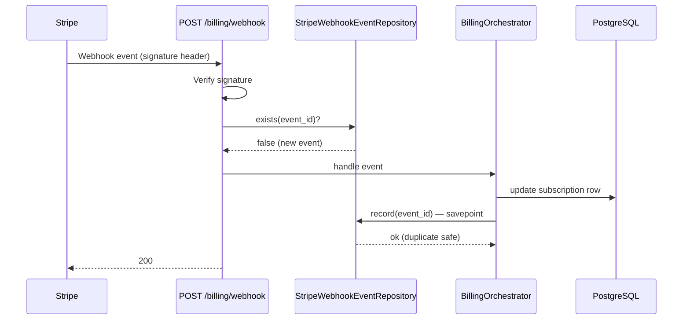

# backend-core

FastAPI SaaS backend template — user management, multi-tenant orgs, Stripe billing, feature flags, API keys, and audit logging. Designed to be cloned and extended with a product-specific layer.

---

## Tech Stack

| Concern | Library |
|---|---|
| Framework | FastAPI |
| DB ORM | SQLModel + SQLAlchemy (async) |
| DB driver | asyncpg |
| Migrations | Alembic |
| Auth | Supabase JWT (ES256/RS256, JWKS verification) |
| Billing | Stripe |
| Email | Resend |
| Rate limiting | slowapi |
| Logging | structlog (JSON, request_id propagation) |
| Settings | pydantic-settings |

---

## Architecture



### Stripe Webhook Flow



Concurrent duplicate events are safe — `record()` uses a savepoint so an `IntegrityError` on the unique `event_id` rolls back only the insert, not the subscription update.

---

## Getting Started

**Prerequisites:** Python 3.12+, a Supabase project, Stripe account.

```bash
cp .env.example .env
# Fill in DATABASE_URL, SUPABASE_URL, SUPABASE_JWT_SECRET,
# SUPABASE_ANON_KEY, STRIPE_SECRET_KEY, STRIPE_WEBHOOK_SECRET,
# and STRIPE_PRICE_* keys

pip install -e ".[dev]"
alembic upgrade head
uvicorn src.main:app --reload
```

Health check: `curl localhost:8000/api/v1/health`

---

## Running Tests

```bash
pytest tests/ -v
```

Tests hit a real database — set `DATABASE_URL` in `.env`. Only Stripe and email are mocked.

---

## Key Conventions

- Every endpoint declares `response_model=XResponse`. No raw `dict`, no `Any`.
- Handlers are thin: validate input → call service → return schema. No business logic in handlers.
- All logging uses `structlog` with `request_id` bound per request. No `print()`.
- Rate limiting keys authenticated requests by `user_id` from the JWT, not IP.
- Use `X | None` not `Optional[X]`. Use `from collections.abc import` for `Callable`, `AsyncGenerator` etc.

---

## Folder Structure

```
src/
  api/v1/           # Thin route handlers
  configs/settings/ # Pydantic BaseSettings, one file per concern
  core/
    dependencies/   # FastAPI DI (get_db, get_current_user)
    exceptions/     # Typed exceptions + error envelope handlers
    middleware/     # Request logging, CORS, rate limit, timeout, body limit
    registry.py     # Long-lived singletons (DB session factory)
  models/           # SQLModel table=True definitions
  repositories/     # DB queries, return SQLModel instances
  schemas/          # Pydantic request/response schemas
  services/         # Business logic, raises typed exceptions
  utils/            # structlog setup
```

---

## Used Together

This repo is the backend half of a two-repo SaaS template. The frontend counterpart is [frontend-core](https://github.com/siddarthanath/frontend-core) — a Next.js 16 App Router shell that consumes this API. Both repos are designed to be cloned together and extended with a product-specific layer.
